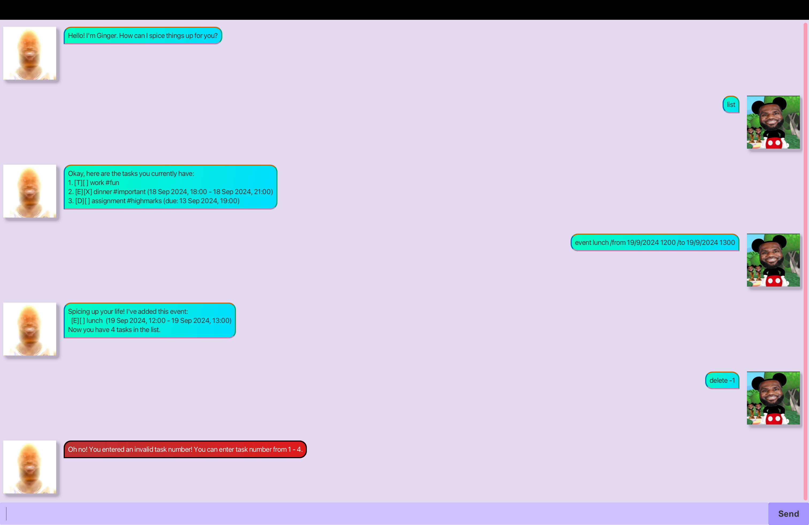

# Ginger User Guide

Ginger is a chatbot that allows you to record and track your tasks. It provides support for various tasks.

## Step-by-step Download Guide
1. Ensure you have Java 17 or above installed.
2. Download the latest .jar file from [here.](https://github.com/sayglenn/ip/releases/tag/A-Release)
3. Move the file to an empty folder.
4. Use a command terminal and `cd` into the folder the jar file is in. 
5. Run`java -jar ginger.jar` to run the application.

## Features

### Add Tasks
There are three types of tasks available to add on Ginger. All tasks share a common trait of being able to mark as completed / incompleted.

#### To Do
A To Do is described as a task with usually no time-frame associated with it, such as buying groceries or walking the dog.

General Usage:
- `todo (title)`: Creates a to do task with a title associated with it.

Examples:
- `todo buy groceries`
- `todo go for a run`

#### Deadline
A Deadline is described as a task with a due date and time associated with it, such as a homework assignment or form submissions.

General Usage:
- `deadline (title) /by (time)`: Creates a deadline task with a title and deadline associated with it.

Examples:
- `deadline assignment 1 /by 21/09/2024 2359`
- `deadline submit report /by 23/09/2024 1400`

#### Event
An Event is described as a task with a duration associated with it, such as a dinner or meetup.

General Usage:
- `event (title) /from (time) /to (time)`: Creates an event with a title and duration associated with it.

Examples:
- `event lunch /from 20/09/2024 1200 /to 20/09/2024 1300`
- `event networking /from 22/09/2024 2000 /to 22/09/2024 2200`

### Mark / Unmark Tasks
A task can be marked or unmarked to show its completion status, which is useful to track which tasks have been finished or not.

General Usage:
- `mark (index)`: Marks the specified task number.
- `unmark (index)`: Unmarks the specified task number.

### List Tasks
The tasks can be listed out for a user's convenience to refer to all tasks in the list.

General Usage:
- `list`: Displays the user's task list in a numbered format.

### Delete Tasks
A task can be deleted should it have been completed or not needed anymore.

General Usage:
- `delete (index)`: Deletes the specified task number from the list.

### Find Tasks
A task can be searched for given an input.

General Usage:
- `find (search terms)`: Finds all tasks that contain the search terms.

### Tag Tasks
A task could be tagged to include small bits of information related to the task.

General Usage:
- `tag (index) (tag name)`: Tags the specified task number with the given tag name.

### Help
Provides help to the user for the usage of the commands for Ginger.

General Usage:
- `help`

### Task Storage
Tasks will be automatically stored in the hard disk after adding each task. There is no need to create a file or amend the task list manually.